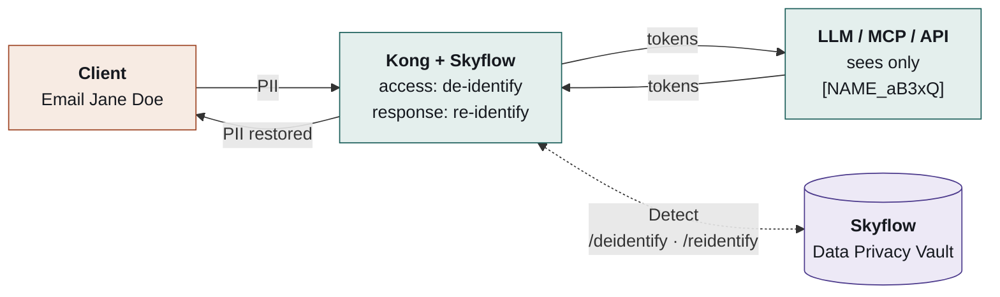
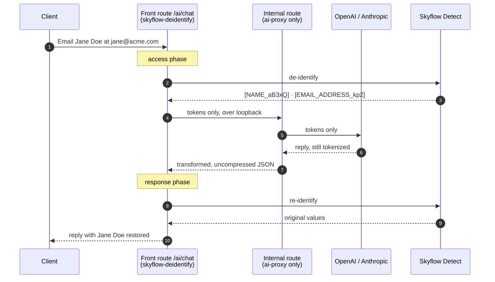

# Skyflow Plugin for Kong Gateway

Put Kong in front of any LLM, MCP server, or API and guarantee that **PII, PHI,
secrets, and other regulated data are tokenized before they leave your trust
boundary** — then transparently restored for authorized callers on the way back.

The custom `skyflow-deidentify` plugin calls **Skyflow's Detect De-identify /
Re-identify APIs** to sanitize request bodies bound upstream and re-hydrate the
originals in responses. It composes with **Kong AI Gateway (`ai-proxy`)**, so
the model provider only ever sees tokens.



> **Status: working proof-of-concept.** De-identify (request) and re-identify
> (response, both `mapping_only` and vault-backed `reidentify_text`) are
> implemented and **verified end-to-end against a live Skyflow vault and real
> OpenAI, with Kong `ai-proxy` in the path**. Packaged as the two self-contained
> files Konnect requires ([`schema.lua`](plugin/kong/plugins/skyflow-deidentify/schema.lua)
> and [`handler.lua`](plugin/kong/plugins/skyflow-deidentify/handler.lua)).
> Service-account JWT auth (RS256, scoped tokens, context-aware `ctx`) is
> implemented and verified live. Streaming re-identify and file-attachment
> de-identify are documented follow-ups. See the [roadmap](#roadmap).

---

## What it does

- **De-identify on the way in** — detects and tokenizes PII/PHI/secrets in the
  request body (chat prompts, tool arguments, arbitrary JSON) before Kong
  proxies upstream. The LLM/tool receives only tokens.
- **Re-identify on the way out** — restores the original values in the response
  for authorized callers, either from a request-scoped map (`mapping_only`, no
  extra call) or vault-authoritatively via Skyflow (`reidentify_text`).
- **Works with Kong AI Gateway** — composes with `ai-proxy` (OpenAI, Anthropic,
  and other providers) via a nested-proxy pattern (see [Architecture](#architecture)).
- **Vault-backed, reversible tokenization** — values become tokens that can be
  detokenized later under Skyflow's fine-grained governance, not one-way
  placeholders. Backed by 300+ entity detectors, transformations (e.g.
  date-shifting), and multiple token formats.
- **Caller-conditional access (context-aware auth)** — with service-account JWT
  auth the gateway mints short-lived Skyflow bearers in-process and stamps them
  with a `ctx` claim of arbitrary JSON shape, layered from config
  (`context_json`/`context`), request headers, and trusted gateway-derived
  facts (`context_kong`), so vault policies can grant or mask re-identification
  per caller (`$ctx.<attr>`); `role_ids` further scope the bearer.
- **Agent tool containment** — real agent traffic (Claude Code verified live)
  works end-to-end: Anthropic-native streaming, tool calls, tool results. Tool
  inputs stay **tokenized by default** (`reidentify.tool_inputs`), so files an
  agent writes and searches it runs carry vault tokens, never raw PII — real
  values only materialize at the gateway on authorized paths.
- **Fail-closed by default** — if Skyflow is unreachable or a response can't be
  re-identified, the configured posture (`deny`) blocks rather than leaks. Also
  supports `dry_run` (log detections, don't alter traffic) and body/span limits.
- **Konnect-deployable** — ships as the two-file, `require`-free build that
  Konnect Dedicated Cloud Gateways and self-managed/hybrid data planes accept.

## Why Skyflow (vs. Kong's built-in AI Sanitizer)

Kong ships an [AI PII Sanitizer](https://developer.konghq.com/plugins/ai-sanitizer/)
that calls an external anonymizer container. This plugin follows the same proven
gateway pattern but is backed by the **Skyflow Data Privacy Vault**, adding:

- **Reversible** tokenization + **policy-governed** re-identification (per-caller
  Skyflow roles, context-aware policies, audit logging) — not just one-way masking.
- **300+ detectors**, transformations, and format-preserving / entity-only /
  unique-counter token formats.
- **Compliance posture** — data residency, isolation, and auditability provided
  by the vault, not the gateway node.

## Architecture

The plugin runs in two Kong phases: **`access`** (de-identify the request before
it's proxied) and **`response`** (re-identify the buffered response before it
reaches the client). For a plain upstream that's all you need — one route, one
plugin.

### Composing with `ai-proxy` — the nested-proxy pattern

`ai-proxy` cannot share a route with a response-phase re-identifier. It transforms
the LLM response in its `header_filter`, while re-identify must run in the
`response` phase (it calls Skyflow over a cosocket, which Kong bans in
`body_filter`). On one route the two fight over the buffered body and `ai-proxy`
returns `500 "no response body found when transforming response"` — but only when
the upstream body is gzip-encoded, which real OpenAI always is (see
[Kong #14380](https://github.com/Kong/kong/issues/14380)).

The fix is **two routes, two independent buffered cycles**:



Two routes means two independent buffered cycles. The front route does de-id and
re-id; its upstream is an internal route running `ai-proxy` alone, so the front
route only ever sees `ai-proxy`'s already-transformed, uncompressed JSON — which
it can handle exactly like a plain LLM upstream. Verified live, and reproduced
offline in [`test/offline-harness/`](test/offline-harness/).

The only parties that ever see raw values are the client, Kong worker memory
(transiently), and the Skyflow vault. Full design in [`architecture`](docs/contributing/architecture.md).

## Getting started

### Prerequisites

- **Docker** + Docker Compose — for the offline harness.
- To install on your own gateway, additionally: a **Konnect account**
  ([free sign-up](https://konghq.com/products/kong-konnect/register)),
  the [`deck`](https://docs.konghq.com/deck/) CLI, a **Skyflow vault**, and a
  **service account** configured for RFC 8693 token exchange with the Detect
  de-identify/re-identify permissions. The plugin is STS-only and holds no
  Skyflow credential of its own: it exchanges the caller's own identity token for
  a short-lived Skyflow bearer, so there is no API key to configure. For a real
  LLM you also need an **OpenAI** or **Anthropic** API key for `ai-proxy`.

### Try it offline first (no accounts, no keys)

A fully self-contained harness: db-less Kong + a mock Skyflow + a gzip mock LLM.
Proves the whole de-id → `ai-proxy` → LLM → re-id round-trip offline.

```bash
make e2e     # brings the stack up, asserts both directions, tears it down
```

Or drive it by hand. The plugin is STS-only, so every request needs a caller
identity token; the harness leaves `expected_issuer`/`expected_audience` unset so
an unsigned fixture JWT is enough — still no accounts and no keys:

```bash
docker compose -f test/offline-harness/docker-compose.yml up -d --wait

JWT=eyJhbGciOiJub25lIiwidHlwIjoiSldUIn0.eyJzdWIiOiJkZW1vLXVzZXIiLCJlbWFpbCI6ImRlbW9AZXhhbXBsZS5jb20iLCJuYW1lIjoiRGVtbyBVc2VyIn0.sig

curl -s localhost:8010/ai/chat -H 'content-type: application/json' \
  -H "authorization: Bearer $JWT" \
  -d '{"messages":[{"role":"user","content":"Reply to Jane Doe at jane@acme.com"}]}' | jq .
```

You get a normal answer with `Jane Doe` in it, while the mock LLM only ever saw
tokens:

```bash
docker logs skyflow-mock-llm-local 2>&1 | grep RECEIVED
# MOCK-LLM RECEIVED: Reply to [NAME_aB3xQ] at [EMAIL_ADDRESS_kp2]
```

The harness also includes a `/broken/chat` route that reproduces the #14380 500,
so you can see the failure the nested pattern fixes. Details:
[`test/offline-harness/README.md`](test/offline-harness/README.md).

### Install it — streamed custom plugin

This is the only supported integration path. The plugin runs on a data plane
whose **image you never touch**. `handler.lua` and
`schema.lua` are uploaded to the control plane and pushed to every node over the
existing cluster connection, so installing and upgrading the plugin is an API call
(or a form in Gateway Manager) rather than a build-push-deploy cycle. This is also
the only way a custom Lua plugin can run on a Dedicated Cloud Gateway, where the
image is not yours to build.

Config lives in [`deploy/streaming/`](deploy/streaming/). Three data-plane
settings make it work, and two are non-obvious:

| Setting | Why |
| --- | --- |
| `KONG_CUSTOM_PLUGIN_STREAMING_ENABLED=on` | Defaults to **off**. Without it the control plane strips streamed plugins from the config and reports issue **P309** — and the node keeps serving its last good config, which for a privacy gateway can mean proxying with no de-identification at all. |
| `KONG_UNTRUSTED_LUA=lax` | Streamed code runs in the untrusted-Lua sandbox, which defaults to `strict` and forbids `require()`. Measured against 3.15.0.2: `strict` **fails**, `lax` **works**, `on` works but removes the sandbox entirely. `sandbox` plus `untrusted_lua_sandbox_requires` fails despite the documentation. |
| `KONG_PLUGINS=bundled` | Must **not** name `skyflow-deidentify`. Listing it makes Kong demand the code locally at boot and the node dies before the stream arrives. |

Because the handler is sandboxed, globals the sandbox withholds are nil at
runtime even though the Lua is valid — `setmetatable` cost a production outage
this way. `make globals` scans both streamed files for that class of bug.

```bash
# upload the plugin code once per control plane (Gateway Manager →
# Plugins → New plugin → Create custom plugin → Streamed custom plugin,
# or the equivalent API call):
#   POST /v2/control-planes/{cp}/core-entities/custom-plugins
#        { "name": ..., "schema": <schema.lua>, "handler": <handler.lua> }

cd deploy/streaming
export DECK_KONNECT_TOKEN=kpat_... DECK_KONNECT_ADDR=https://us.api.konghq.com
deck gateway sync kong.yaml --konnect-control-plane-name <your-cp>
```

> Streaming and the older `plugin-schemas` endpoint are **mutually exclusive**. If
> a control plane already has a registered plugin schema from an older build,
> remove it
> before uploading, or the upload conflicts.

Konnect config edits reach running data planes in about ten seconds with no
restart. Plugin *code* changes need a config change alongside them to trigger the
push.

## Repository layout

```text
plugin/kong/plugins/skyflow-deidentify/
├── schema.lua      # config contract — require-free (Konnect upload constraint)
├── handler.lua     # self-contained: auth (STS delegation) + Skyflow Detect
│                   #   client + JSONPath-lite body targeting + de-id + re-id
└── *.rockspec      # self-managed / local installs only

deploy/streaming/        # THE deployment path — there is deliberately only one
├── Dockerfile           #   data plane carrying only the three streaming settings
└── kong.yaml            #   services, routes and plugin config (deck)

test/offline-harness/    # NOT a deployment option: a self-contained test fixture
├── docker-compose.yml   #   db-less Kong + mock Skyflow + gzip mock LLM
├── kong.yaml
├── mock-skyflow/        #   canned reversible tokenization + a mock STS endpoint
└── mock-llm/            #   logs what the upstream actually received

scripts/
└── bundle-streamed-plugin.sh   # strips comments to fit Konnect's 102,400-byte cap

spec/
├── offline/pure_algorithms_test.lua   # runs under `resty` in the Kong image (make unit-pure)
├── offline/no_undefined_globals.sh    # undefined + sandbox-forbidden globals (make globals)
├── offline/auth_methods_test.sh       # auth methods + the ctx asymmetry (make auth-methods)
└── skyflow-deidentify/                # schema + access + response specs (Pongo/busted)

demo/                    # on-camera steps for recording the walkthrough
docs/                    # design spec (see Documentation map below)
```

## Roadmap

The core de-identify → LLM → re-identify flow — including vault-backed
re-identify and, as of v0.3.0, service-account JWT auth (RS256) with scoped
tokens and context-aware `ctx` claims — is implemented and verified live (see
[What it does](#what-it-does)). Planned next:

| Planned | Notes |
| --- | --- |
| Streaming re-identification | Reassemble streamed responses; today `buffer` / `passthrough` |
| File-attachment de-identification | De-identify uploaded files, not just JSON request bodies |

## Documentation map

**For operators / users** — [`docs/using/`](docs/using/):

| Doc | What's inside |
| --- | --- |
| [overview.md](docs/using/overview.md) | Goals, use cases (LLM, MCP, generic), non-goals, glossary, design decisions |
| [security.md](docs/using/security.md) | Threat model, data handling, RBAC/governance, compliance, logging & redaction |
| [operations.md](docs/using/operations.md) | Config recipes (decK/Admin/KIC/Konnect), observability, latency budget, rollout |
| [deployment.md](docs/using/deployment.md) | Konnect packaging constraints, the 2-file build, upload & validate steps |

**For contributors** — [`docs/contributing/`](docs/contributing/):

| Doc | What's inside |
| --- | --- |
| [architecture.md](docs/contributing/architecture.md) | Components, phases, sequence diagrams, the `ai-proxy` nested-proxy pattern, streaming, failure modes |
| [skyflow-integration.md](docs/contributing/skyflow-integration.md) | Skyflow Detect De-identify / Re-identify / Detokenize APIs, auth, token formats, mapping model |
| [plugin-spec.md](docs/contributing/plugin-spec.md) | Full `schema.lua` config reference, handler phases, PDK usage, scoping/priority |
| [testing.md](docs/contributing/testing.md) | Unit / integration / e2e strategy, Pongo + busted, mocks, fixtures |
| [development.md](docs/contributing/development.md) | Repo layout, dependencies, local dev loop, CI |

## License & ownership

Internal Skyflow proof-of-concept. See [overview.md](docs/using/overview.md#non-goals)
for scope boundaries.
