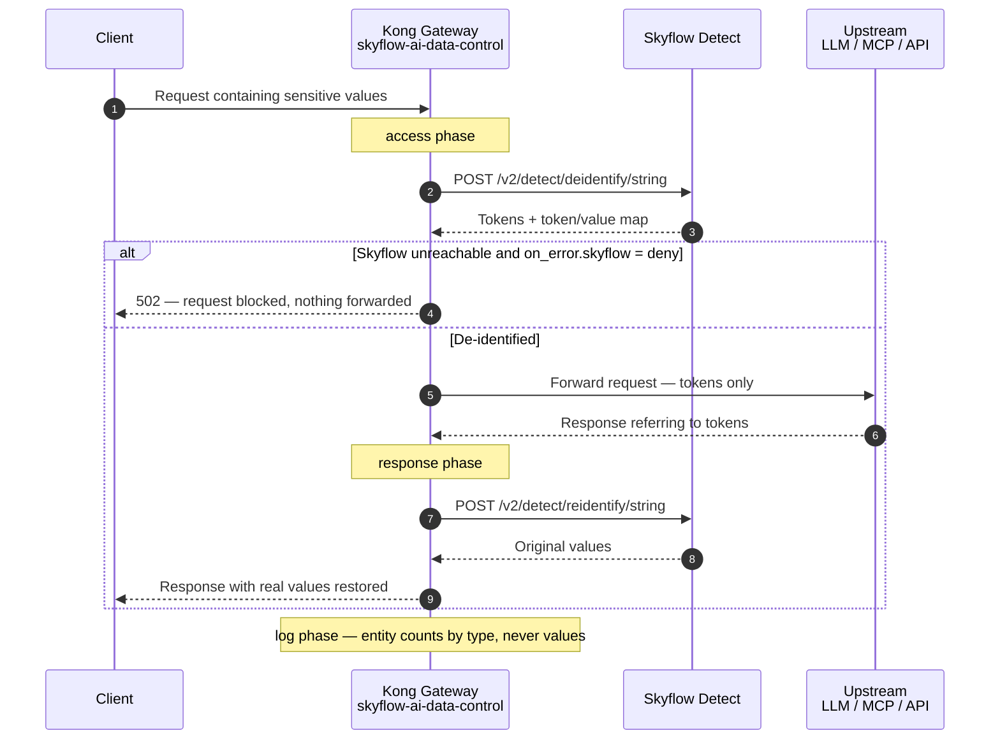
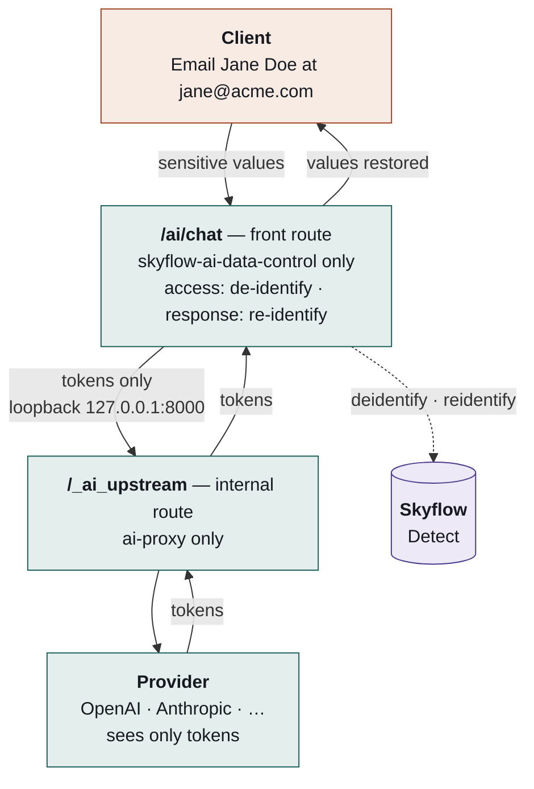

# Partner plugin doc submission — `skyflow-ai-data-control`

> Filled-in submission for Kong's partner plugin doc template
> (see [`partner-submission.md`](partner-submission.md) for the blank skeleton and
> the [`prisma-airs-intercept`](https://developer.konghq.com/plugins/prisma-airs-intercept/)
> reference sample this mirrors).

## Samples

Format model: [https://developer.konghq.com/plugins/prisma-airs-intercept/](https://developer.konghq.com/plugins/prisma-airs-intercept/)

## Required collateral

- **Logo icon (64×64)** — [`skyflow-icon.svg`](skyflow-icon.svg) (preferred; scales
  cleanly) and [`skyflow-icon-64.png`](skyflow-icon-64.png). The Skyflow mark: the
  brand navy `#403E6B`, sampled from the official assets, with the `s` traced from
  the official wordmark so the letterform is the real one rather than a substitute
  typeface. Glyph size and corner radius match Skyflow's own favicon.
- **Plugin schema (JSON)** — [`skyflow-ai-data-control.schema.json`](skyflow-ai-data-control.schema.json)
  (generated from the plugin's `schema.lua`).
- **Luarock** — `skyflow-ai-data-control` (`skyflow-ai-data-control-0.6.0-1`).
  Source: `git+https://github.com/SkyflowFoundry/skyflow-kong-poc.git`, tag `v0.6.0`.
  For Konnect, the plugin is uploaded as two self-contained files
  (`schema.lua` + `handler.lua`) rather than a rock.

## Doc template

### Introduction

Use the **Skyflow De-identify** plugin (`skyflow-ai-data-control`) to put Kong in front of any
LLM, MCP server, or API and guarantee that **PII, PHI, secrets, and other regulated data
are tokenized before they leave your trust boundary** — then transparently restored for
authorized callers on the way back.

Applications increasingly send prompts, tool arguments, and JSON payloads to LLM
providers, MCP servers, and third-party APIs — often carrying regulated data. Once that
data reaches a third party you've lost control of it: it can be logged, trained on,
cached, or subpoenaed. This plugin makes Kong the enforcement point and the
**Skyflow Data Privacy Vault** the system of record: Skyflow's **Detect** APIs do the
detection, reversible tokenization, and policy-governed re-identification, so the model
provider only ever sees tokens.

Benefits of de-identifying traffic with the Skyflow De-identify plugin:

- **Reversible, policy-governed tokenization** — values become Skyflow vault tokens that
  can be re-identified per-caller under Skyflow roles, context-aware policies, and audit
  logging. Not just one-way masking.
- **300+ entity detectors and transformations** — names, emails, SSNs, credit cards,
  healthcare identifiers, and more, plus transformations such as date-shifting and
  multiple token formats (`VAULT_TOKEN`, `ENTITY_ONLY`, `ENTITY_UNQ_COUNTER`).
- **Composes with Kong AI Gateway** — sits alongside `ai-proxy` via a nested-proxy pattern
  so the model provider (OpenAI, Anthropic, and others) receives only tokens.
- **Fail-closed by default** — if Skyflow is unreachable or a response can't be
  re-identified, the configured posture (`deny`) blocks rather than leaks. A `dry_run`
  mode logs detections without altering traffic.
- **Deployable on Konnect and self-managed** — ships as two self-contained files that
  Konnect Dedicated Cloud Gateways and hybrid data planes accept as a streamed custom
  plugin, with no third-party rock dependencies, and as a LuaRock for self-managed
  installs.

### How it works

When you enable this plugin on a route, it acts in two Kong request-lifecycle phases:

- **`access`** — runs before the request is proxied upstream. The plugin reads the request
  body, extracts the target text spans (selected by the **wire format detected from the
  body** — OpenAI, Anthropic, or MCP — plus any explicit JSONPath selectors), calls
  Skyflow **De-identify**
  (`POST /v2/detect/deidentify/string`), and rewrites the outbound body so the upstream
  receives only tokens (e.g. `[NAME_aB3xQ]`). A request-scoped token→value map is stashed
  for the response phase.
- **`response`** — runs after the full upstream response is buffered but before any byte
  reaches the client. When `reidentify.enabled = true`, the plugin restores the original
  values (via `mapping_only`, the request-scoped map, or `reidentify_text`, a
  vault-authoritative call to `POST /v2/detect/reidentify/string`) and rewrites the
  response body. The end-user sees real values; the provider never did.



**Entities it interacts with.** The plugin attaches to Kong Routes and Services and talks
to the Skyflow Detect API over HTTPS using a bearer token minted from the configured
credential. It emits metrics and structured logs of detected-entity counts by type — never
the values themselves.

**Deterministic tokens.** With `VAULT_TOKEN`, the same input value always maps to the same
token, so multi-message and multi-turn conversations stay coherent even though the provider
only ever saw opaque tokens.

**Composing with Kong AI Gateway (`ai-proxy`).** The plugin does **not** share a route with
`ai-proxy`. `ai-proxy` transforms the LLM response in its `header_filter`, while
re-identify must run in the `response` phase (it calls Skyflow over a cosocket, which Kong
bans in `body_filter`); on one route the two contend for the buffered body and `ai-proxy`
returns `500 "no response body found when transforming response"` whenever the upstream
body is gzip-encoded — which real OpenAI always is
([Kong #14380](https://github.com/Kong/kong/issues/14380)). The fix is a **nested-proxy
topology**: two routes, two independent buffered cycles.



Each route runs its own buffered request/response cycle, which is what keeps the two
plugins out of each other's way. The internal route is not externally reachable — an
`ip-restriction` plugin bound to `127.0.0.1/32` refuses anything else, because that route
carries neither authentication nor de-identification.

**Real agent traffic.** Beyond simple JSON bodies, the plugin handles coding-agent /
MCP traffic: it reads large bodies that nginx spools to disk, re-identifies values inside
`tool_calls[].function.arguments` (not just message content), and buffers streaming
(`stream: true`) responses — re-identifying the full completion, then re-emitting it as
SSE — so a token split across chunks is never leaked.

### Installation details

Luarock name: `skyflow-ai-data-control` (current version `0.6.0-1`).

**Self-managed Kong (OSS / Enterprise):**

```bash
# the rockspec lives with the plugin, not at the repo root
luarocks make ./plugin/kong/plugins/skyflow-ai-data-control/skyflow-ai-data-control-0.6.0-1.rockspec

# then enable it on the node
export KONG_PLUGINS=bundled,skyflow-ai-data-control
```

Dependencies: `lua >= 5.1` and `lua-resty-http >= 0.17` (`resty.http` and `cjson` are
provided by the Kong/OpenResty runtime).

**Konnect (Dedicated Cloud Gateways / hybrid data planes):** do not use the rock. Upload
the two self-contained files — `schema.lua` and `handler.lua` — to the control plane as a
custom plugin (Konnect → Plugins → Custom Plugins), choosing **Streamed** rather than
Installed so no image rebuild or data-plane restart is involved.

The two files pull in no third-party rocks — only libraries the gateway already ships
(`resty.http`, `cjson`, and `resty.openssl.pkey` for service-account JWT signing), all of
which are on the streamed-plugin sandbox allowlist. Streamed plugins run sandboxed, so the
data planes need `KONG_UNTRUSTED_LUA=lax`; under `strict` the sandbox forbids `require`
outright and the config is rejected. See
[`deploy/streaming/data-plane-env.md`](../../deploy/streaming/data-plane-env.md).

### Example configuration

**Prerequisites.** Before enabling the plugin you need:

- A **Skyflow account** and a **Detect vault**. From the vault's page in the Skyflow admin
  console you need its **Vault ID**, **Vault URL** and **Account ID** — the plugin's
  `vault_configuration` block uses those same three names.
- A way to reach the vault. The default `sts` method needs only a **service account ID**:
  the gateway exchanges each caller's own IdP token for a short-lived Skyflow bearer
  (RFC 8693), so it stores no Skyflow credential at all. The `jwt_credential` and
  `bearer_token` methods do hold one; both fields are referenceable and stored encrypted,
  so pass a `{vault://...}` reference rather than a literal.
- The credential's Skyflow role must permit **de-identify** (and **re-identify**, if you
  restore values on the response).

**De-identify only — the model never sees raw values.** The plugin tokenizes the prompt
before Kong proxies the request. Re-identification is off, so the caller receives tokens
too, which suits a strict egress posture.

```yaml
plugins:
  - name: skyflow-ai-data-control
    config:
      skyflow:
        vault_configuration:
          vault_id: "{vault_id}"
          vault_url: "https://{cluster}.vault.skyflowapis.com"
          account_id: "{account_id}"
        credentials:
          method: sts
          sts:
            service_account_id: "{vault://env/SKYFLOW_SERVICE_ACCOUNT_ID}"
            expected_issuer: "https://login.microsoftonline.com/{tenant}/v2.0"
            expected_audience: "{client_id}"
        deidentify:
          entities: [NAME, EMAIL_ADDRESS, PHONE_NUMBER, SSN, CREDIT_CARD]
          token_format: VAULT_TOKEN
        reidentify:
          enabled: false
```

**De-identify and re-identify — the provider sees tokens, the caller sees real values.**
This is the default posture, so it needs less config than the one above:

```yaml
plugins:
  - name: skyflow-ai-data-control
    config:
      skyflow:
        vault_configuration:
          vault_id: "{vault_id}"
          vault_url: "https://{cluster}.vault.skyflowapis.com"
        credentials:
          method: sts
          sts:
            service_account_id: "{vault://env/SKYFLOW_SERVICE_ACCOUNT_ID}"
        deidentify:
          entities: [NAME, EMAIL_ADDRESS, PHONE_NUMBER, SSN, CREDIT_CARD]
          token_format: VAULT_TOKEN
      operations:
        limits:
          max_spans: 512
```

What the config does:

- `skyflow.vault_configuration` — which vault to call. `vault_url` is taken whole rather
  than assembled from a cluster id, because the host also encodes the environment: a
  sandbox vault lives on `.skyflowapis.tech`.
- `skyflow.credentials` — `method` selects which credential record is read, with no
  fallback between them. Under `sts` the gateway holds nothing: identity is IdP-verified
  per request, and Skyflow logs the human as the Subject with the service account as the
  Actor.
- `skyflow.deidentify.entities` — the entity types to detect. Validated against the types
  the vault has columns for, so a typo is refused when you save rather than silently
  matching nothing. Empty means all of them.
- `skyflow.deidentify.token_format: VAULT_TOKEN` — reversible, deterministic tokens. The
  same value always yields the same token, which is what lets a token minted on one
  conversation turn be resolved on a later one.
- `skyflow.reidentify` — on by default with the vault-authoritative strategy, so the
  second example omits it. Set `enabled: false` for the tokens-only posture.
- `operations.limits.max_spans` — a fail-closed ceiling on how many text spans one request
  may carry; over it the request is refused rather than partly de-identified. Agent traffic
  needs headroom above the default, because a short message can arrive alongside ~30
  resent tool definitions.

**There is no field selecting the API format.** OpenAI, Anthropic and MCP payloads are
detected per request from the body shape, so one config serves all three. A shape the
plugin does not recognise is refused rather than forwarded unscanned.

> **Configuration constraints** (enforced when you save): `reidentify.strategy =
> reidentify_text` requires `deidentify.token_format = VAULT_TOKEN`, since only vault
> tokens exist in the vault to resolve; `mapping_only` requires a format other than
> `ENTITY_ONLY`, because one-way tokens cannot be reversed;
> `deidentify.configuration_source = config_id` requires `config_id`. See
> [`skyflow-ai-data-control.schema.json`](skyflow-ai-data-control.schema.json) for the full
> field reference.
